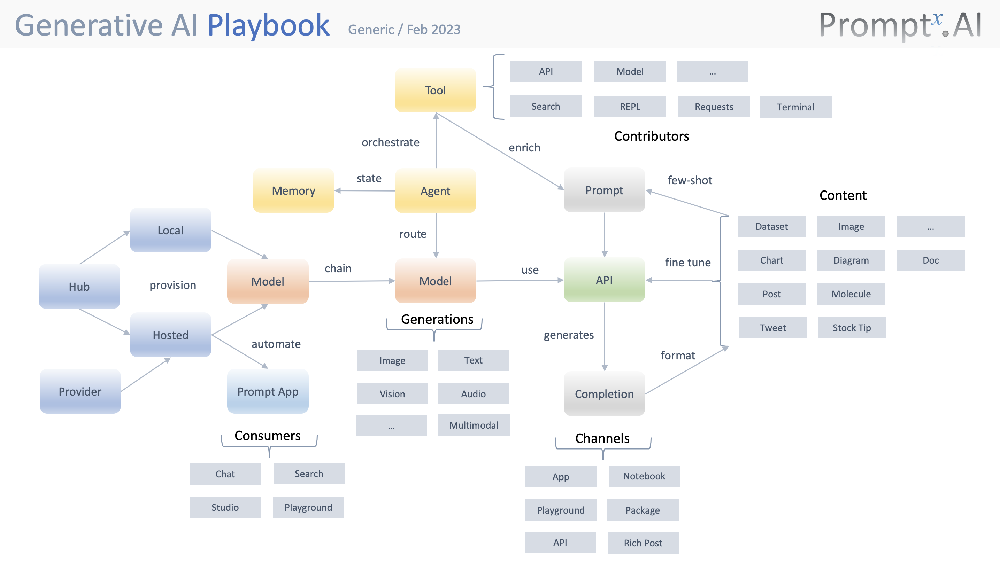

---
tags:
  - Generative AI
  - OpenAI
  - Hugging Face
  - Stability AI
---

# PromptxAI API

PromptxAI API implements the Generative AI playbook. The API abstracts the plumbing required to access Generative AI models and provides higher order capabilities such as blogging, art creation, content parsing, dataset creation, and static site generation.



## Model Card Generation
We have recently launched a new API for generating model cards. Model cards are a great way to document your model and share it with the community. See [notebook](../model-card-generator) for an example of how to generate a model card by parsing latest content about the model from web then passing this along to GPT-3 for querying structured data about the model. Then we use PromptxAI API to generate a model card in markdown format.

## Blogger API
We created Blogger API for human and AI in partnership for low-code blog authoring automation. We are sharing a notebook tutorial so that you can join the exploration. The tutorial walks through basics of AuthorAI + human authoring flow which you can adapt to your needs. Another objective of this notebook is to act as an interactive playground for the AuthorAI library.

Here is an example of a 100% auto generated blog post by just providing three keywords as input to AuthorAI API.

You can auto generate this blog post in a single API call like so.

```python title="Blogger API"
from promptxai import blogger
keywords = 'Physics, Art, City'
blogger.auto_generate(keywords, verbose=True)
```

This generates a blog post in HTML and markdown format like illustrated below.


## Artist API

We have now launched PromptxAI Artist API for working with DALL-E and Stable Diffusion models. See [notebook example](../art-generation-with-dalle-and-stable-diffusion) to explore the API. You can generate random art from text and engineer your prompts based on painting style, surface, origin, and more.

## Jekyll Static Site Generator API
Jekyll is one of the most popular static website generators used among GitHub community. PromptxAI now integrates with Jekyll to generate posts straight into your Jekyll managed static website. See [notebook](../static-site-generation-for-jekyll) used by human author to generate a Jekyll blog post including code snippets, FAQ, multiple sections, and feature image.

