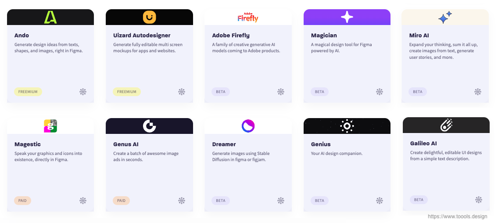

# Navigating the Risks and Limitations of Generative AI in Design

April, 11 2023 | [Paras Aggarwal](https://www.linkedin.com/in/parasaggarwalux/)

Generative AI is no longer just a buzzword, it is already impacting various industries, from productivity tools, to healthcare to finance, and design is no exception. With the advent of generative AI techniques, like OpenAI's ChatGPT-4 for content generation or Midjourney and DALL-E for image generation (and hundreds of other tools), designers now have access to tools that can significantly enhance their creative processes. Check out Adobe’s Firefly image generator, Canva’s ‘magic’ features, Figma AI plugins, Miro AI features, and many more, our favourite products have already started using AI in design workflows. This means, AI is already making its way into our toolkit.

Snapshot of AI Design Tools - March 2023

But as the saying goes, with great power comes great responsibility. While Generative AI has the potential to revolutionise the design process, it also comes with its fair share of risks and limitations. Today, we'll dive into these challenges and discuss strategies for addressing and mitigating potential pitfalls, ensuring you can make the most of AI in a responsible and ethical way.

## The Dark Side of AI in Design

As design professionals, we must be aware of the potential risks associated with using AI in our work. Let's take a closer look at some of the key challenges:

1. **Algorithm hallucination**: One of the serious limitation of generative AI is that unlike humans, AI doesn’t know how to say “I don’t know”. It might make up things to fill the gaps.
2. **Training Staleness**: Quality of output is limited by the data the AI model has been trained on. Fast changing trends may be out of scope for the training. For e.g. training cutoff for ChatGPT-3 is September 2021, which means, it is unaware of current events, trends, or anything that happened after its training. Unless it is connected to the internet and gets realtime updates, the information is limited to its training set.
3. **Over-reliance on AI-generated output:** AI is a powerful tool, but it's essential to maintain a healthy balance between human judgment and AI-generated designs. Without proper validation, AI-generated outputs may not meet usability, accessibility, or ethical standards.
4. **Ethical considerations:** AI systems learn from data, which means biased data can lead to biased design outcomes. It's crucial to recognise and address potential biases to ensure fair and inclusive designs.
5. **Intellectual property concerns:** The legal implications of using AI-generated assets can be complex. Navigating copyright and ownership issues is vital to avoid potential disputes and protect your work. This issue can lead to potential high risk to your company brand and products.
6. **Balancing efficiency and quality:** AI can speed up the design process, but it's essential to strike the right balance between time savings and design quality. Over-reliance on AI-generated elements may result in suboptimal outcomes.
7. **Privacy and data security:** Protecting user data when working with AI systems is critical. Data breaches or privacy violations can have severe consequences for both your users and your company's reputation. The data you are feeding into AI tools may be a potential risk to IP loss.

Humans must act responsibly and ethically with AI-generated output. Image created with Bing AI

## Strategies for Responsible AI Usage

Now that we've identified the potential pitfalls, let's discuss some strategies for addressing and mitigating these risks while using AI in design:

1. **Always keep responsible AI principles in mind:** You and your team don’t need to be an expert in AI but clear understanding of its limitations and the implications can help you make informed decisions.
2. **Maintain a human touch:** Always use human judgment and validation to ensure AI-generated designs meet necessary standards. Keep in mind that AI is a tool to support your work, not replace it.
3. **Treat AI as a source of input** and not as a source of truth. Check the staleness of the training model before using the output.
4. **Transparency is crucial to establish trust**: Understand how the model is making its decisions and what data sources is it referring to generate the results. By Demystifying the technology you can address the fears and concerns that you might have.
5. **Address biases proactively:** Be aware of potential biases in your data and take steps to minimise the impact on your design outcomes. Promote diversity and inclusivity in your designs by validating AI-generated outputs with diverse user groups.
6. **Educate yourself on legal implications:** Familiarise yourself with intellectual property laws and seek legal counsel when necessary to ensure you're using AI-generated assets responsibly. Work with your risk, legal, and compliance teams to evaluate the risks involved in using the AI-powered tools for your work and create a safe framework.
7. **Emphasise quality over speed:** While AI can help you work faster, always prioritise design quality. Evaluate AI-generated elements for their effectiveness, usability, and overall contribution to your design goals.
8. **Prioritise privacy and data security:** Implement best practices for handling user data when working with AI systems. Keep your users' privacy and security at the forefront of your design process. Be thoughtful of how you collect, store and use data.
9. **Create a safe environment for experimentation**: Build a lightweight sandbox environment to help teams play and experiment with the AI generated output in a safe way. Keep an eye on the AI output and validate it with manual test time to time.

By understanding the risks and adopting these strategies you can embrace the power of AI while achieving higher work efficiency responsibly.

## Time to Embrace the Future of Design Responsibly

As a UX design practitioner, it's crucial to stay ahead of the curve and be open to new technologies that can enhance your work. AI is here to stay, and its potential to revolutionise design is immense. So, embrace AI and integrate in your ways of working, but it's essential to approach it with a clear understanding of the risks and limitations. As design professionals, we have a responsibility to ensure our work is ethical, inclusive, and of the highest quality. By addressing potential pitfalls and embracing best practices, we can make the most of AI's transformative power while maintaining the integrity of our designs.

The journey toward responsible AI usage in design starts with awareness and education. Keep learning and stay connected with us. In the next post, we will go through the step-by-step guide to power your design process with AI.

---

**[Paras Aggarwal](https://www.linkedin.com/in/parasaggarwalux/)** is an experienced design leader, disruptive innovation strategist, speaker, and a mentor with over 20 years of hands-on experience in solving business and customer problems through user-led, data-informed Design Thinking approach. He is been exploring the possibilities with Generative AI and defining Design Playbooks to build product experiences.

---
