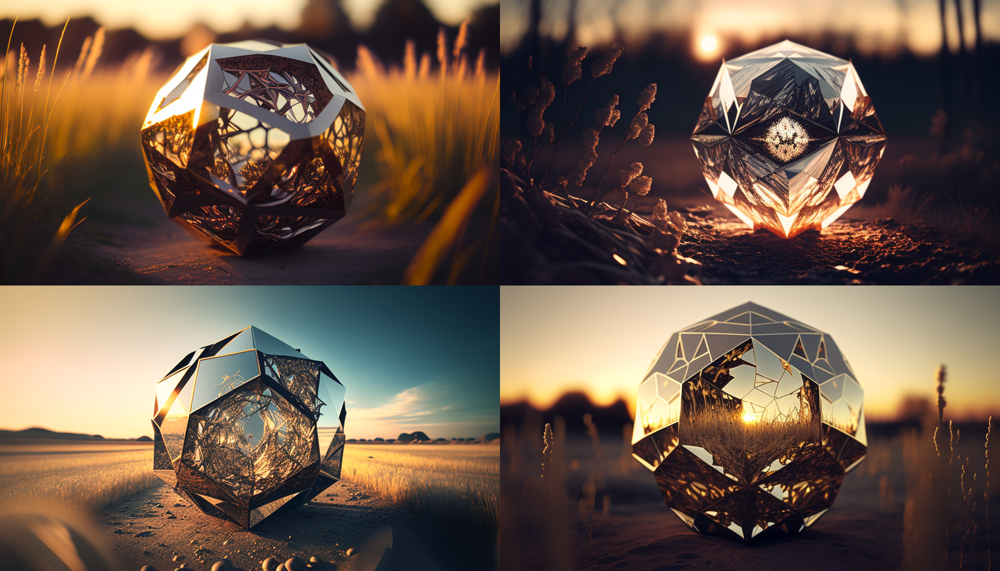
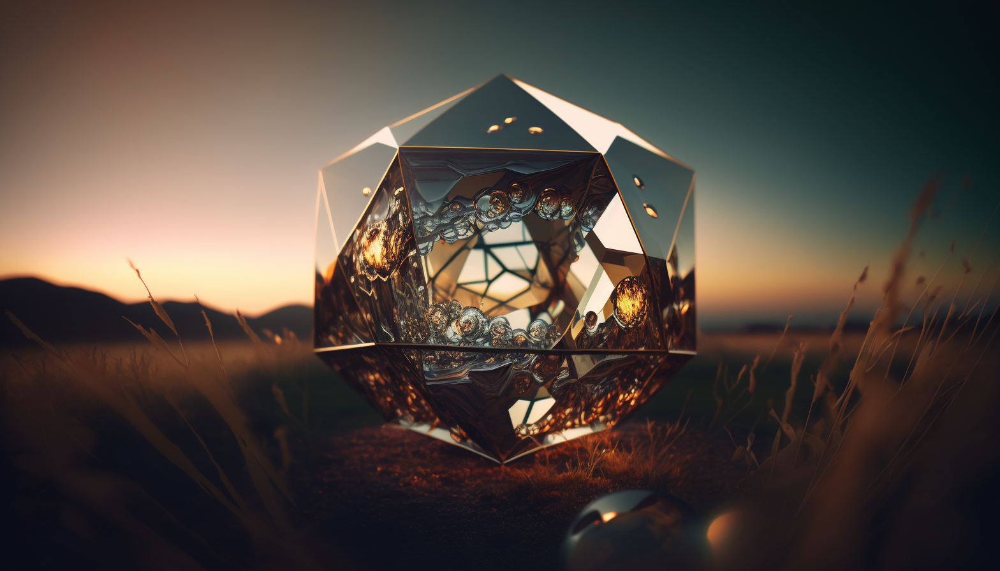
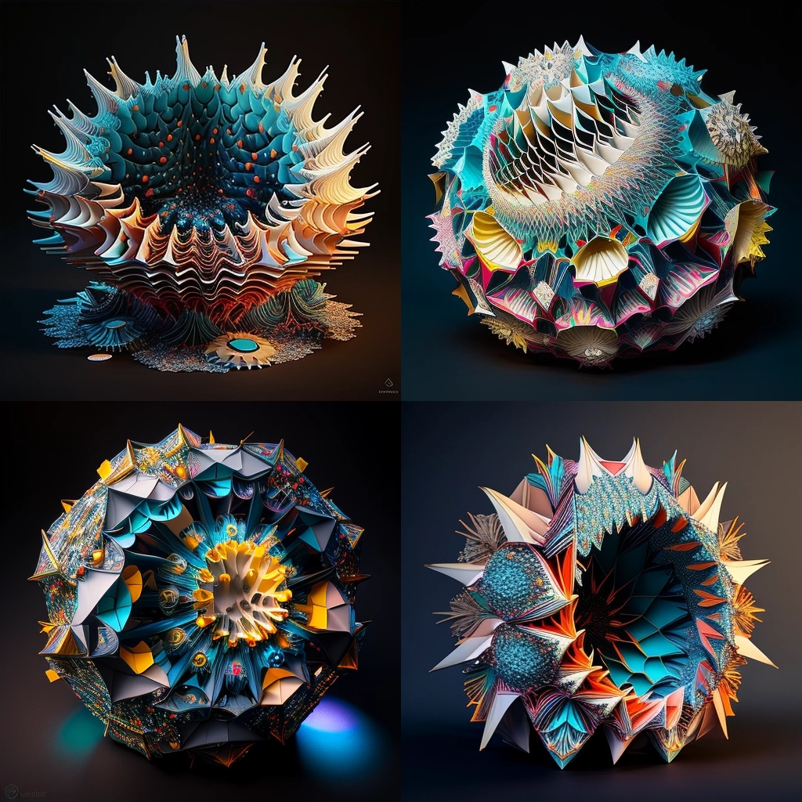
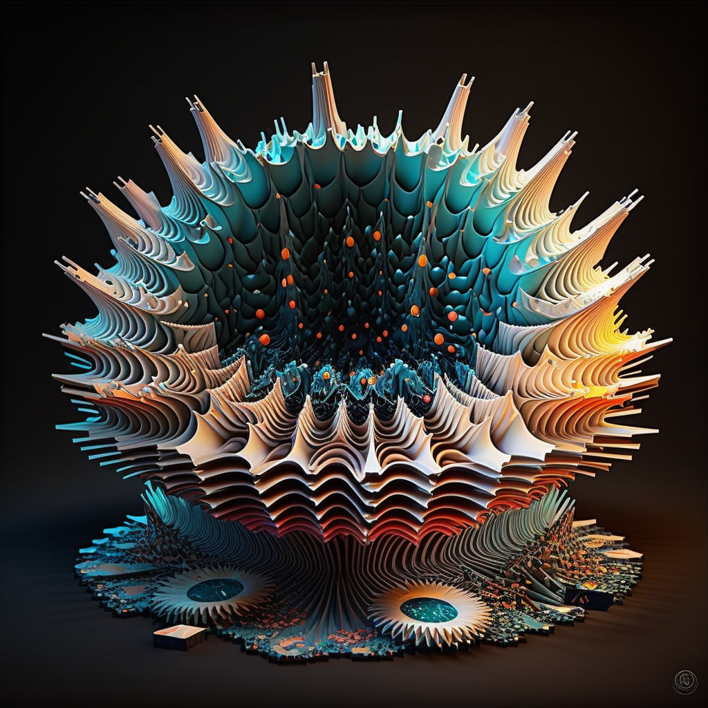
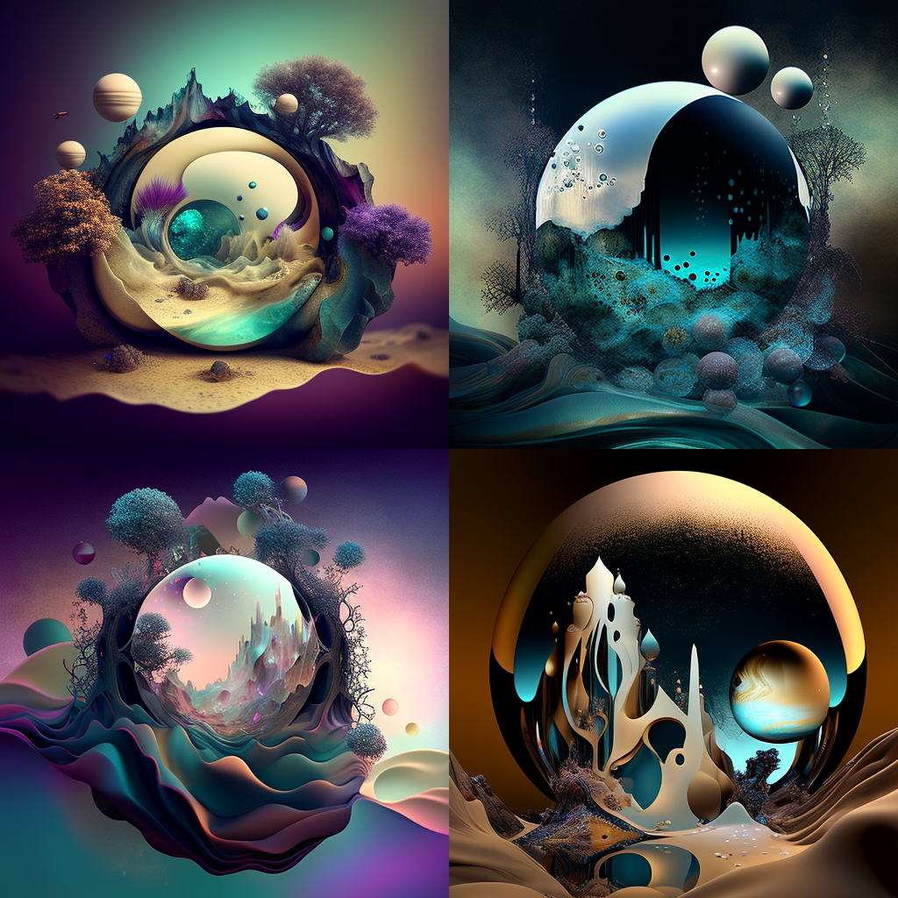
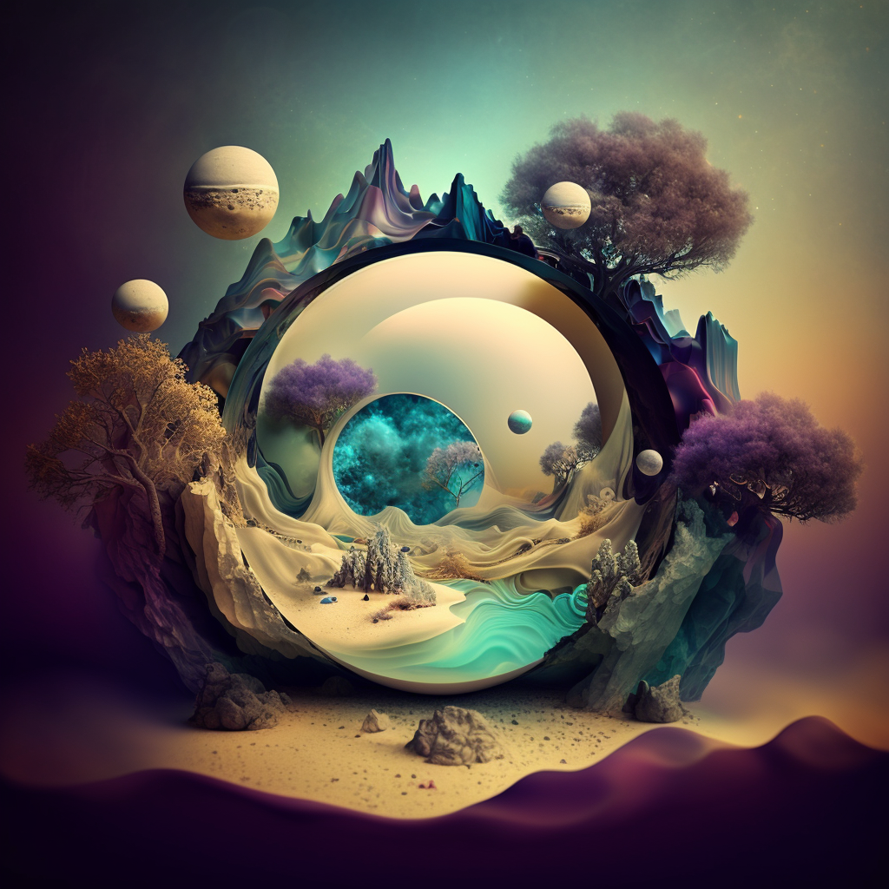

---
tags:
    - Creative Function
    - Film Industry
    - Midjourney Model
    - Image Generation
---

# Cinematic Alien Art Generation

Let’s generate some alien geometries, organic objects, and landscapes using AI! We will use the Midjourney model to generate these images.

!!! info "Guide"
    Use camera and lighting parameters, complex geometry, organic shapes, sense of motion, 
    and style transfer to generate cinematic alien art.

## Cinematic alien geometries

Here is a Midjourney AI model prompt which reads like a professional photographer and mathematician good at geometry jammed together to write.

```yaml title="Midjourney Prompt"
Light Art, Cinematic, 35mm, Perspective, DOF, Field of View, 
Double-Exposure, Hyperdimensional, Icosidodecahedron, Hyperzonohedron, 
Glassy, Mirror, Ray Tracing Reflections --ar 16:9
```

The results are unique and comparable to a professionally shot cinema frame.



To appreciate the intricate detailing we rendered a variation at higher resolution. The workflow to go from an idea in our head to engineering the prompt to generating this completion requires practice and can be accelerated with tooling. We used the awesome [Promptomania](https://promptomania.com/midjourney-prompt-builder/) Midjourney Prompt Builder to pull this off without a professional photographer or a mathematician’s help :smile:.



## Organic alien objects in super detailed 3D

Here is an example of how variation in the prompt, knowledge of how the generative AI model treats each keyword or phrase (hyper realistic, super detailed), appreciation of artistic styles (Harris Shutter), some creative experimentation of what concepts might mix well (seashell, icy, ornate, ocean, origami), helps create a alien-world organic-like object never seen before, yet familiar.

```yaml title="Midjourney Prompt"
Modular Origami, 3D, CMYK, Tesla Coil, Electroluminescent Wire, 
Ray Tracing Global Illumination, Depth Map, Icy, Ocean, Seashell, 
Ray Tracing Reflections, Anaglyph, Harris Shutter, Tone Mapping, 
insanely detailed and intricate, hypermaximalist, elegant, ornate, 
hyper realistic, super detailed 
```



Notice the intricate details in the completion.




## Mesmerizing alien landscapes

You can also chain prompt creation by providing requirements in plain english to generate a prompt which in turn is used to generate the final model output.

```yaml title="ChatGPT Prompt"
Act like a professional artist and midjourney advanced prompt 
engineering expert to create a prompt using most of midjourney's advanced 
capabilities to generate a super intricate, detailed, highly professional art
about a mesmerizing alien landscape. #(1)!
```

1. :bulb: You can replace `a mesmerizing alien landscape` with any other topic of your choice to generate a Midjourney prompt for a different subject.

Which generates this completion. Note the detailing in English descriptive text as apparently ChatGPT is trained on a more detailed variant of prompt style compared to the above two examples.

!!! note "ChatGPT Completion >> Midjourney Prompt"
    Title: 'Ethereal Dreamscape' 
    Generation type: Image Generation Style: Surrealism 
    Subject: A dream-like landscape filled with strange and mysterious elements, 
    floating in an endless void. Instructions: Use a mix of abstract shapes, fluid 
    forms, and organic textures to create an ethereal atmosphere. Include a central 
    focal point such as a large glowing orb or surreal structure surrounded by 
    smaller elements that drift and swirl. Experiment with lighting effects and 
    a range of colors to add depth and energy. Advanced: Stylistic transfer 
    (surrealism), image manipulation (warping, blending, layering), 3D generation, 
    and animation.

Which generates a more complex image from Midjourney when compared to other examples.



Here is a more detailed view.



